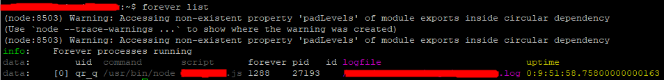

# FORVER 사용하기
nodeJS 는 에러에 민감하다. 운영중에 nodeJs에서 에러가 발생하면 모든 서비스가 다운된다.
이것을 방지하기위해 nodeJS는 forever 와 함께 사용하기를 권장한다. \

## forever 설치
```
npm install forever -g
```
## forever 명령
아래 3가지가 FOREVER의 대표적 명령어들이다.
### forever 시작
```
forever start [script 명]
```
바로 start명령을 입력할 경우 log의 위치는 ~/.forever/ 아래에 위치한다.
특정경로에 로그 파일을 출력하고자 한다면
```
forever start -a -l [path of log file] [실행할 파일.js]
```


### forever 실행목록 보기
```
forever list
```

### forever 종료
```
forever stop [uid]
```

